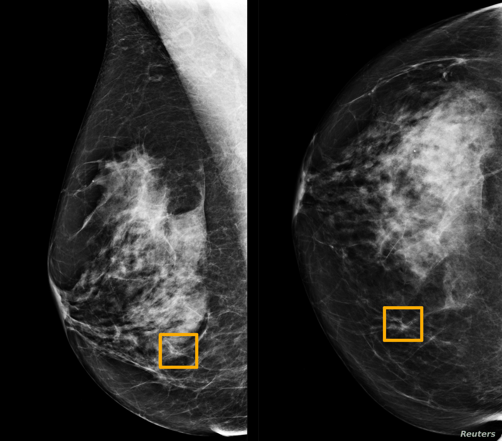

# Breast Cancer Detection Artificial Neural Network - HackDavis 2020

#### The Event 
UC Davis's Premir Hack-A-Thon for social good! On January 18-19, over 600 students, hackers, and creators came together for 24 hours of hacking. For the 5th year in a row, the most talented students in California come together to address the world’s most pressing issues. Participants are able to build projects that address any social good initiatives.
#### Team's Solution
Build and train an Artificial Neural Network that predicts, based on CSV data, whether or not the data in question indicates the presence of breast cancer. The ANN returns its prediction as the probability that the data in question is malignant and the probability that the data in question is benign. The two prediction percentages will add up to 100. [View Project Website Here](https://devpost.com/software/ml-diagnose)

### Prerequisites
* Anaconda (Python 3.7 Version)
  - [Anaconda Instillation Instructions](https://docs.anaconda.com/anaconda/install/)
  - Chosing to use Anaconda is optional; however, the Spyder environment included is very useful for Machine Learning projects

## Libraries to Install
* keras - neural network library
  - `conda install -c conda-forge keras`
* pandas - software library for data manipulation and analysis
  - `conda install -c anaconda pandas`
* scikit learn - machine learning library
  - `conda install -c anaconda scikit-learn`
* numpy - general-purpose array-processing package
  - `conda install -c anaconda numpy`
* pickle - module used for serializing and de-serializing a Python object structure
  - `conda install -c anaconda pickle`

## Running the tests

* First, download the file titled finalized_breast_cancer_model.sav
* Next, open Anaconda, launch Spyder (used version 3.3.6 to create this program), and run the program titled: breast_cancer_prediction_regression.py
  - NOTE: You must download and save breast_cancer_prediction_regression.py in the same directory that you saved finalized_breast_cancer_model.sav in.
  - NOTE: There is another file titled breast_cancer_ann.py. This file contains much of the same code as breast_cancer_prediction_regression.py; however, this is the module that was used to train the ANN, and it is not necessary to re-run this file. The regression equation has been exported to the breast_cancer_prediction_regression.py file, so this is all that needs to be executed.
* Next, the user will be propted to answer a series of questions relating to data of the sample in questions. These questions likely won't have an relevance to the average person, and the average person won't have access to the necessary data reqired to answer these questions. For this reason, this program is geared more towards professional health-care workers.
* Once all the data is answered, the user will see the neural network's prediction as to whether the sample is malignant or benign, and they will also see the probability that the data in question is malignant and the probability that it is is benign. The two prediction percentages will add up to 100.

## Final Thoughts
* After training the model, our team was able to get it to classify images in the test set with **97.43% accuracy**. This accuracy was obtained with very little testing or manipulation of the hyperparameters. A next step with this project could be using a gradient descent algoithm with the regression equation to find the best values for the hyperparameters. If done, the ANN can likely reach accuracies of over 99%. Furthermore, if more data is used to train the model, then it is also very likely that the prediction accuracy will increase, assuming that overfitting does not occur.
* Furthermore, there is a file included that is titled breast_cancer_ann_lda. This program runs a linear determinant analysis on the data, and uses this to make a prediciton. This model was created with the idea of dimensionality reduction, and hopefully isolating the most important independent variables, allowing us to discard the non-important variables. This would also help to avoid overfititng. There was not enough time to explore this algoirthm further though, so this could be a useful next step with the project.

## Authors

* **William Schmidt** - [Wil's LikedIn](https://www.linkedin.com/in/william-schmidt-152431168/)
* **Danial Khan** - [Danial's LikedIn](https://www.linkedin.com/in/danial-khan-98415b18b/), [Danial's GitHub](https://github.com/danialk1?tab=repositories)
* **Matthew Meer** - [Matt's LikedIn](https://www.linkedin.com/in/matthew-meer-8356b572/), [Matt's GitHub](https://github.com/meerkat1293?tab=repositories)
* **Awen Li** - [Awen's GitHub](https://github.com/BabyMochi)

## Acknowledgments

* Thank you to UC Davis and Major League Hacking for hosting this event!
  - [HackDavis 2020 Website](https://hackdavis2020.devpost.com/?ref_content=default&ref_feature=challenge&ref_medium=discover)
